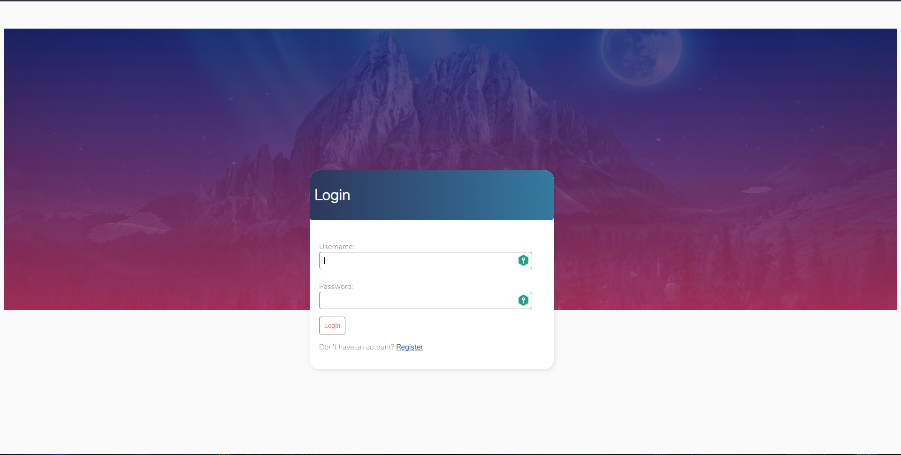
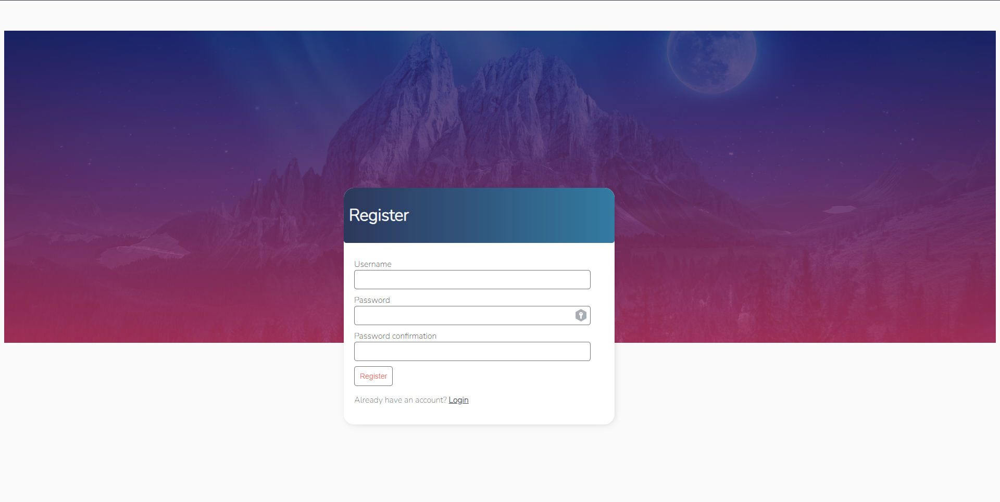
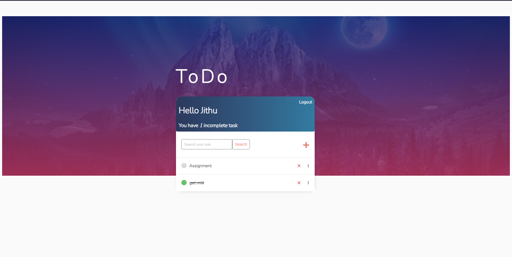
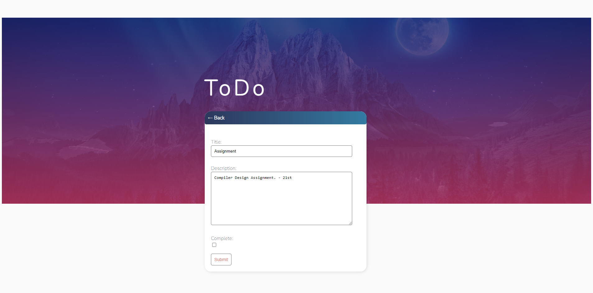

# Django Todo List Project

This is a Django project that allows users to create and manage their todo lists. It provides user authentication, allowing multiple users to create accounts, login, and manage their own tasks. Users can add new tasks, edit existing tasks, mark tasks as complete, and delete tasks if needed.

## Features

- User authentication: Users can create accounts, log in, and log out.
- Task management: Users can add new tasks, edit existing tasks, mark tasks as complete, and delete tasks.
- Secure authentication: The project implements secure authentication measures to protect user accounts and data.

## Installation

Follow these steps to set up the project on your local machine:

1. Clone the repository:

   ```shell
   git clone [<repository-url>](https://github.com/jithu-francis017/ToDo-List)
   ```
2. Change into the project directory:

   ```shell
   cd todo-list
   ```
4. Set up the database:

   ```shell
   python manage.py migrate
   ```
5. Start the development server:

   ```shell
   python manage.py runserver
   ```
6. Open your web browser and visit [http://localhost:8000/](http://localhost:8000/) to access the application.

## Usage

1. Register a new account or log in with your existing credentials.
2. Once logged in, you will be redirected to the todo list page.
3. To add a new task, click on the "Add Task" button and enter the task details.
4. To edit a task, click on the task you want to edit and update the details.
5. To mark a task as complete, click on the checkbox next to the task.
6. To delete a task, click on the "Delete" button next to the task.
7. Log out when you're done using the application.

## Contributing

Contributions are welcome! If you find any issues or would like to enhance the project, feel free to open a pull request. Please make sure to follow the code style and include tests for your changes.

## License

This project is licensed under the [MIT License](LICENSE).

## Acknowledgements

- This project was inspired by the Django framework and its community.
- Special thanks to the developers and contributors of the open-source packages used in this project.

## Screenshots












